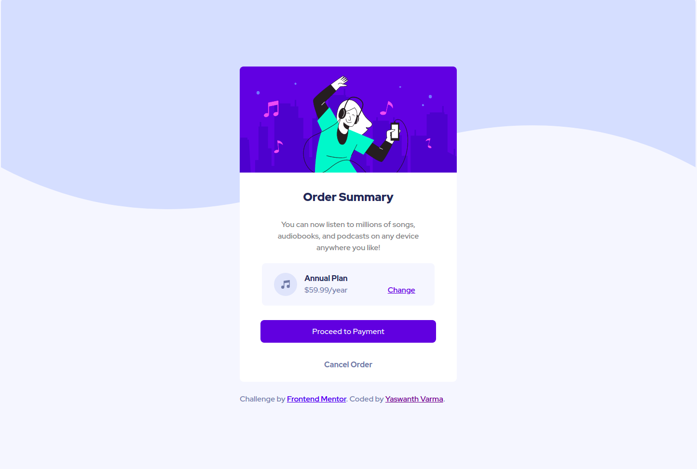

# Frontend Mentor - Order summary card solution

This is a solution to the [Order summary card challenge on Frontend Mentor](https://www.frontendmentor.io/challenges/order-summary-component-QlPmajDUj). Frontend Mentor challenges help you improve your coding skills by building realistic projects.

## Table of contents

- [Overview](#overview)
  - [The challenge](#the-challenge)
  - [Screenshot](#screenshot)
  - [Links](#links)
- [My process](#my-process)
  - [Built with](#built-with)
  - [What I learned](#what-i-learned)
  - [Continued development](#continued-development)
  - [Useful resources](#useful-resources)
- [Author](#author)

## Overview

I recently started learning HTML and CSS, So I just took this newbie challenge to check whether I can apply those what I've learned. This is my first project so it was a bit difficult to do and got stuck in middle, after searching in docs for minutes, I finally managed to complete the challenge. But what I've done is not entirely same as the challenge, So I am looking for some feedback and advices to improve my skills.

### The challenge

Users should be able to:

- See hover states for interactive elements

### Screenshot

### Links

- Solution URL: [https://github.com/YaswanthVarma362/order-summary-challenge](https://github.com/YaswanthVarma362/order-summary-challenge)
- Live Site URL: [https://yaswanthvarma362.github.io/order-summary-challenge/](https://yaswanthvarma362.github.io/order-summary-challenge/)

### Built with

- Semantic HTML5 markup
- CSS custom properties

### What I learned

I recently started learning HTML and CSS and this is a perfect challenge for my newbie skills. I did everything based on the things I learned and haven't learned any new thing. But hope to learn new things in future.

### Continued development

I found it difficult doing on my own, but figured it out by checking some docs. But still it is not correctly done, I hope I can learn and do it exactly as the challenge.

### Useful resources

- [This Website](https://developer.mozilla.org/en-US/) - helped me to check basic syntax and provided solutions when I'm stuck.

## Author

- Frontend Mentor - [@YaswanthVarma](https://www.frontendmentor.io/profile/YaswanthVarma362)
